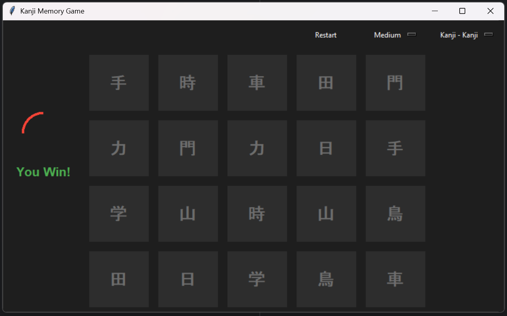

# Kanji Memory Game

An interactive memory game for learning Kanji, Kana, and their meanings, built with Python and Tkinter.

---

## 🎮 Game Description

- Classic memory game with Kanji cards.
- Supports multiple **game modes**:
  - **Kanji ↔ Kanji**: Classic matching game.
  - **Kanji ↔ Meaning**: Match Kanji with their English/German meaning.
  - **Kanji ↔ Kana**: Match Kanji with their reading (Kana).
- **Timer**: Time limit per difficulty level, with an animated progress circle.
- **Difficulty Levels**:
  - **Easy**: 6 pairs, 60 seconds
  - **Medium**: 10 pairs, 50 seconds
  - **Hard**: 16 pairs, 60 seconds

---

## 📝 Features

- Dark theme with accent colors.
- Card flip animation when revealing cards.
- Responsive grid layout for different numbers of cards.
- Over 40 Kanji included with Kana and meaning.

## 🎮 Screenshot

Here's what the game looks like:



## 📚 Example Data

```python
kanji_data = [
    {"kanji": "日", "kana": "にち", "meaning": "Sun / Day"},
    {"kanji": "月", "kana": "つき", "meaning": "Moon"},
    {"kanji": "火", "kana": "ひ", "meaning": "Fire"},
    {"kanji": "水", "kana": "みず", "meaning": "Water"},
    {"kanji": "木", "kana": "き", "meaning": "Tree"},
    {"kanji": "金", "kana": "かね", "meaning": "Gold / Money"},
    {"kanji": "土", "kana": "つち", "meaning": "Earth / Soil"},
    {"kanji": "山", "kana": "やま", "meaning": "Mountain"},
    {"kanji": "川", "kana": "かわ", "meaning": "River"},
    {"kanji": "田", "kana": "た", "meaning": "Rice Field"},
    # ... more Kanji
]
